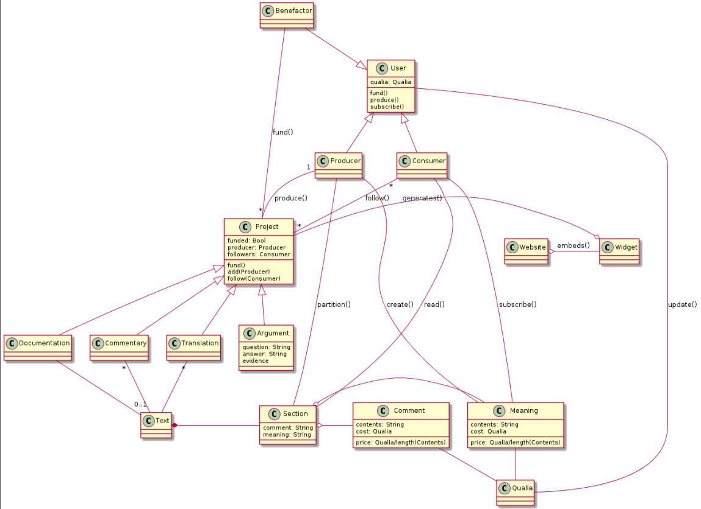

<h2>Table of Contents</h2>

<ul>
<li><a href="#sec-1">1. Components of Dialectic:</a>
<ul>
<li><a href="#sec-1-1">1.1. User</a>
<ul>
<li><a href="#sec-1-1-1">1.1.1. Producer</a></li>
<li><a href="#sec-1-1-2">1.1.2. Consumer</a></li>
<li><a href="#sec-1-1-3">1.1.3. Benefactor</a></li>
</ul>
</li>
<li><a href="#sec-1-2">1.2. Qualia</a></li>
<li><a href="#sec-1-3">1.3. Project</a>
<ul>
<li><a href="#sec-1-3-1">1.3.1. Commentary</a></li>
<li><a href="#sec-1-3-2">1.3.2. Argument</a></li>
<li><a href="#sec-1-3-3">1.3.3. Documentation</a></li>
<li><a href="#sec-1-3-4">1.3.4. Translation</a></li>
</ul>
</li>
<li><a href="#sec-1-4">1.4. Text</a>
<ul>
<li><a href="#sec-1-4-1">1.4.1. Section</a></li>
</ul>
</li>
<li><a href="#sec-1-5">1.5. Widget</a></li>
</ul>
</li>
</ul>

Who will benefit:
1.  those who'd like to understand an important or difficult topic
2.  those who'd like to explain an important or difficult topic
3.  future members of groups 1) or 2) for whom Dialectic makes important or difficult topics relevant/accessible

Which topics are important?  We won't judge - they're simply the one's people care about.  Dialectic gives people a way to communicate about them with
more clarity.  Topics range from interpretations of Game of Thrones episodes to existential threats faced by humanity to JavaScript frameworks.  What Dialektic does
for each of these is to facilitate the most meaningful exchange possible.

# Components of Dialectic:

## User

### Producer

### Consumer

### Benefactor

## Qualia

Qualia is an accounting system that represents units of cognition.  Users are given a certain amount of Qualia to begin with and are responsible for maintaining a positive
balance if they'd like to continue to participate in Dialectic.

## Project

There are ways of earning or losing Qualia that are unique to each project.

### Commentary

1.  Competitors

    -   Diskus

2.  Use Cases

    1.  As an editor of a periodic online journal, I am considering adding comment sections to our articles.  Given the caustic dialog comment sections often produce with

        controversial topics, I'm weary of creating one more outlet for trolling and hate.  I wish there were a prescriptive medium for facilitating commentary by readers
        that would shift the focus to content and away from allegiances.

### Argument

1.  Competitors

    -   Quora
    -   Wikipedia

2.  Use Cases

    1.  As a believer in X, I would like a way of advocating my viewpoint where:

        1.  there is a mechanism to show the degree to which my arguments, and those of my opponents, conform to reality

        2.  I do not have to repeat myself

            and talk in circles.  My argument stands as an artifact ready to be scrutinized.  It relates to a topic or question &#x2013; not a particular instance of misapprehension or
            oneupmanship I may be burdoned to address.

        3.  those with essentially the same viewpoint can collaborate on an arguments

            Lines of reasoning that are more well thought out and systematic lend themselves to support from more angles than those wedged together by fallacious reasoning.
            Rather than having each person express their agreement by working on seperate instances or arguments, there should be a way of building onto arguments that are essentially
            the same, and not doing the same work twice.

    2.  As someone hoping to decide on a diet that's right for me

        I can't find a consensus.

### Documentation

1.  Competitors

    -   Sphinx

2.  Use Cases

    1.  As the creator of a helpful but admittedly obscure JavaScript library

        I know that the tool I created won't be used if it's not understood.  This means I need to produce cogent documentation to attract readers.  One problem is that
        it is fairly difficult to explain to those without the domain knowledge I have how or why they should use my product.  To accelerate the adoption rate,
        I want to write the documentation in such a way that adapts to the understanding of the reader.  Those without the domain knowledge can create the foundation on which
        in-depth learning can follow later.

        This is in direct opposition to the most common methods of domain knowledge pedagogy: it is understood that there is complicated machinery under the hood of the tool
        you are trying to use, and newcomers are given an interface that hides this complexity, at the risk of occasional engendering of misconceptions that will need to be
        corrected later (hopefully before it makes itself known in the form of a bug in production-ready software).  The Dialectic approach to documentation is to keep the entirety of
        the object to be understood in mind at all times, but to arrive at a consensus as to what this object means to a variety of prospective users.

    2.  As someone hoping to learn to code

        I am unable to find learning resources that don't assume background knowledge.

### Translation

1.  Competitors

    -   multilingual individuals &#x2013; disadvantage: are unable to collaborate effectively
    -   github/version control systems &#x2013; disadvantage: no easy/automatic way to establish consensus among many opinions
    -   translation services &#x2013; disadvantage: are expensive, represent very few viewpoints
    -   automatic translations &#x2013; disadvantage: are in need of correction/incapable of handling complex/subtle material

2.  Use Cases

    1.  As a blogger, I'd like to reach foreign-language readers

        Sometimes readers will offer to translate my articles into other languages.  I would like to give readers who want to get my content to fellow speakers of their language an easy tool to collaborate,
        so that participants in the translation process can multiply.

    2.  As a polyglot, I'd like to work on translations but don't have the time to work single-handedly

        If there were some way to collaborate on the translation of texts, I'd be much more likely to contribute.

## Text

### Section

1.  Meaning

    Created by a producer and subscribed to by a consumer.  A section of a text related to a project can have at most one meaning.

2.  Comment

## Widget

The widget is an HTML5 web-component that allows the embedding of a project into another site.
